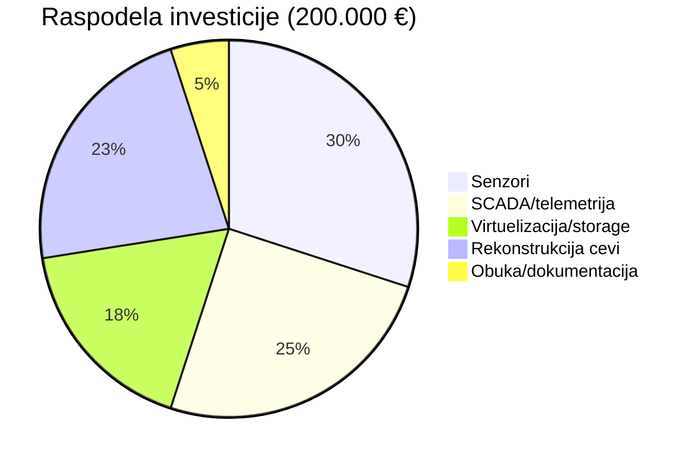
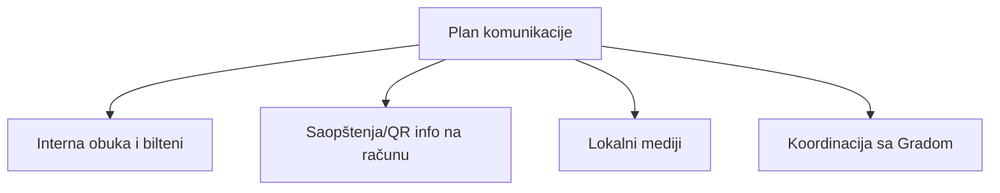

# Feasibility Study – Modernizacija fabrike vode i vodovodne mreže u Kikindi


_Figura 0: Ilustracija objekta i mreže (zameniti stvarnom fotografijom)_

---

## Sadržaj
1. Finansijska procena (Financial appraisal)
2. Tehnička procena (Technical feasibility)
3. Organizacijska procena (Organizational feasibility)
4. Operativna procena (Operational feasibility)
5. Kulturna procena (Cultural feasibility)
6. Rizici (Risk assessment)
7. Zaključak
8. Dodatak: Vremenski plan (Gantt) i KPI

---

## 1. Finansijska procena (Financial appraisal)

Projekat modernizacije fabrike vode u Kikindi je finansijski isplativ jer donosi značajno smanjenje gubitaka vode i troškova održavanja. Ukupna investicija iznosi oko 200.000 €, a očekivani povraćaj investicije (ROI) je manji od dve godine.

Projekat se uklapa u finansijske mogućnosti JKP „Vodovod i kanalizacija“ i može se delimično finansirati iz državnih i lokalnih fondova. Sredstva će biti obezbeđena kombinacijom internog budžeta i sredstava Fonda za zaštitu životne sredine.

### 1.1 Raspodela investicije (predlog)
| Stavka                          | Opis                                     | Iznos (€) | Napomena                         |
|---------------------------------|------------------------------------------|-----------|----------------------------------|
| Senzori kvaliteta i pritiska    | Ugradnja na kritičnim tačkama mreže      | 60.000    | 100+ senzora, kalibracija        |
| SCADA i telemetrija             | Server, RTU/PLC, licencije               | 50.000    | Redundantni SCADA serveri        |
| Virtuelizacija i storage        | Hypervisor, SAN/NAS, backup              | 35.000    | RAID, snapshot, offsite replika  |
| Rekonstrukcija kritičnih cevi   | Zamena najkritičnijih deonica            | 45.000    | Fokus na zone sa gubicima        |
| Obuka i dokumentacija           | Trening osoblja, SOP                     | 10.000    | 5 dana + priručnici              |
| Rezerva                         | Neplanirani troškovi (contingency ~5%)   | 0         | Uključeno u stavke               |
| Ukupno                          |                                          | 200.000   |                                  |

_Figura 1: Tabela investicionih stavki i iznosa_

### 1.2 Uštede i ROI (ilustracija)
| Godina | Procena uštede gubitaka (€) | Ušteda održavanja (€) | Ukupno uštede (€) | Kumulativno (€) |
|--------|------------------------------|------------------------|-------------------|-----------------|
| 1      | 70.000                       | 20.000                 | 90.000            | 90.000          |
| 2      | 70.000                       | 20.000                 | 90.000            | 180.000         |
| 3      | 70.000                       | 20.000                 | 90.000            | 270.000         |

- Procena vremena povrata: ~1.8 godina (200.000 € / 110.000 € prosečnih godišnjih ušteda 1–2. godina)
- Napomena: Brojke su indikativne i prilagođavaju se nakon detaljne hidrauličke analize.


_Figura 2: Podela budžeta po kategorijama_

---

## 2. Tehnička procena (Technical feasibility)

Organizacija poseduje tehnički kadar i iskustvo u održavanju vodovodnih sistema. Projekat uključuje ugradnju senzora kvaliteta vode, SCADA sistem i virtuelizovanu infrastrukturu, što je tehnički izvodljivo.

Dobavljači opreme postoje na domaćem tržištu, a dodatna obuka osoblja biće sprovedena kako bi se obezbedila puna operativnost sistema.

### 2.1 Referentna arhitektura SCADA sistema
```mermaid
graph TD
  subgraph Terenski sloj
    S1[Senzori: pritisak, protok, zamućenje, hlor] --> RTU1[RTU/PLC 1]
    S2[Senzori: pH, konduktivnost] --> RTU2[RTU/PLC 2]
  end

  RTU1 -->|Modbus/RTU, 4-20mA| GW[Gateway/Edge]
  RTU2 -->|Modbus/TCP| GW

  GW -->|VPN/L2TP/IPSec| FW[Firewall]
  FW -->|TLS| SCADA[SCADA Server (Primary)]
  FW -->|TLS| SCADA2[SCADA Server (Secondary)]

  SCADA --> HMI[HMI/Operator konzole]
  SCADA --> DB[(Historian DB)]
  SCADA --> ALM[Alarm & Events]
  SCADA --> REP[Izveštaji i dashboardi]
```
_Figura 3: Predložena topologija SCADA i telemetrije sa redundansom_

### 2.2 Tok podataka i kvaliteta
```mermaid
flowchart LR
  Sensors[Senzori kvaliteta i protoka] --> Edge[Edge filtriranje/normalizacija]
  Edge --> SCADA[SCADA]
  SCADA --> Historian[(Historian/TS DB)]
  Historian --> Analytics[Analitika/KPI]
  Analytics --> Dash[Dashboard (menadžment, laboratorija)]
  SCADA --> CMMS[CMMS (radni nalozi)]
```
_Figura 4: Tok podataka od senzora do analitike i operativnih odluka_

### 2.3 Lista ključnih senzora i lokacija (primer)
| Lokacija                  | Parametar                | Tip senzora         | Opseg         | Tačnost  | Komunikacija |
|---------------------------|--------------------------|---------------------|---------------|----------|--------------|
| Izlaz iz fabrike          | Pritisk / Protok         | Elektromagnetni     | 0–500 m3/h    | ±0.5%    | 4–20 mA      |
| Zonski rezervoar A        | Nivo / Zamućenje         | Ultrazvučni / NTU   | 0–10 m / 0–5  | ±1% / ±2%| Modbus RTU   |
| Gradski čvor (kritičan)   | Pritisak                 | Piezo rez.          | 0–16 bar      | ±0.25%   | LoRaWAN/GW   |
| Laboratorija              | pH / Konduktivnost       | Komb. elektroda     | 0–14 / 0–20 mS| ±0.02 / ±1%| USB/LAN     |


_Figura 5: Ilustracija zoniranja i kritičnih tačaka (zameniti projektnim planom)_

---

## 3. Organizacijska procena (Organizational feasibility)

JKP „Vodovod i kanalizacija“ ima dovoljan broj zaposlenih sa znanjem iz oblasti tehničkog održavanja, laboratorijske kontrole i IT podrške. Postojeća oprema će biti nadograđena, a organizaciona struktura omogućava efikasno sprovođenje projekta.

Preduzeće već ima iskustvo sa projektima rekonstrukcije cevovoda, što dodatno olakšava realizaciju modernizacije i digitalizacije fabrike vode.

### 3.1 RACI matrica (primer)
| Aktivnost                               | R (izvršilac) | A (odgovoran) | C (konsultovan)        | I (informisan)          |
|-----------------------------------------|---------------|---------------|------------------------|-------------------------|
| Nabavka senzora i RTU                   | Tehnička sl.  | Direktor teh. | Finansije, Laboratorija| Menadžment              |
| Implementacija SCADA                    | IT/OT tim     | IT rukovodilac| Dobavljač SCADA        | Operativno odeljenje    |
| Zamena kritičnih cevi                   | Terenska ekipa| Direktor teh. | Projektant             | Korisnički servis       |
| Obuka i SOP                             | HR + IT/OT    | Direktor      | Dobavljači             | Svi zaposleni           |

### 3.2 Organizacioni dijagram (sa projektnim timom)
```mermaid
graph LR
  CEO[Direktor] --> PM[Projektni menadžer]
  PM --> TechLead[Tehnički lead (OT)]
  PM --> ITLead[IT lead (infra)]
  PM --> OpsLead[Operative/terenske ekipe]
  PM --> QA[Laboratorija/QA]
  ITLead --> Sec[Cyber/Backup]
  TechLead --> SCADAteam[SCADA/PLC]
  OpsLead --> PipeTeam[Rekonstrukcija cevi]
```
_Figura 6: Organizacija i odgovornosti_

---

## 4. Operativna procena (Operational feasibility)

Postoji jasno definisana struktura upravljanja projektom, sa timom koji uključuje inženjere, IT stručnjake i menadžment. Nakon implementacije, sistem će raditi pod nadzorom tehničkog odeljenja.

Planirano je uspostavljanje rezervnog servera i automatskog sistema backup-a radi očuvanja podataka o kvalitetu i distribuciji vode.

### 4.1 Topologija backup/DR
```mermaid
graph TD
  Users[Operateri/HMI] --> Prim[Primarni SCADA]
  Prim --> Hist1[Historian 1]
  Prim --> Bkp[Backup sistem (snapshots)]
  Bkp --> Offsite[Offsite replika (S3/remote NAS)]
  Prim --> SecSCADA[Sekundarni SCADA (Failover)]
  SecSCADA --> Hist2[Historian 2]
```
_Figura 7: Redundantna SCADA i strategija backup/DR_

### 4.2 Operativni protokoli i SLA (primer)
| Protokol/SOP                      | Opis                                     | SLA/Metrički cilj               |
|----------------------------------|------------------------------------------|----------------------------------|
| Reakcija na alarm visokog NTU    | Automatska notifikacija, terenska provera| TTR < 2h, zatamnjenje < 30 min  |
| Zamena senzora (kvar/kalibracija)| Planirano mesečno/na kvar                | 95% u okviru 72h                 |
| Backup i verifikacija            | Dnevni inkrementalni + nedeljni full     | Obnova testa kvartalno < 4h      |
| Patch menadžment                 | Bezbednosni i funkcionalni               | 100% kritični zakrpe < 7 dana    |

---

## 5. Kulturna procena (Cultural feasibility)

Zaposleni i menadžment JKP „Vodovod i kanalizacija“ su motivisani da sprovedu ovaj projekat. Projekat je etički i društveno opravdan jer poboljšava javno zdravlje i kvalitet života građana.

Inicijativa ima punu podršku lokalne zajednice i ne izaziva nikakve negativne društvene posledice.

### 5.1 Stejkholder mapa (interes × uticaj)
| Stejkholder                 | Interes | Uticaj | Strategija angažovanja              |
|----------------------------|---------|--------|-------------------------------------|
| Menadžment JKP             | Visok   | Visok  | Redovni izveštaji, KPI review       |
| Operative/terenske ekipe   | Visok   | Srednji| Obuke, SOP, povratna informacija    |
| Laboratorija               | Visok   | Srednji| Validacija podataka, kalibracije    |
| Lokalna zajednica          | Srednji | Srednji| Transparentna komunikacija (objave) |
| Dobavljači                 | Srednji | Srednji| Ugovorni KPI, servisni nivoi        |

### 5.2 Plan komunikacije


---

## 6. Rizici (Risk assessment)

Glavni rizici su moguća kašnjenja u nabavci opreme, tehničke poteškoće prilikom implementacije i privremeni prekidi u snabdevanju vodom. Svi rizici su prepoznati i planirane su mere za njihovu kontrolu, uključujući faznu implementaciju i rezervne dobavljače.

Negativne posledice su kratkoročne i prihvatljive u odnosu na koristi projekta – smanjenje gubitaka, čistu vodu i stabilno vodosnabdevanje.

### 6.1 Registar rizika (primer)
| ID | Rizik                                  | Ver. | Uticaj | Nivo | Mera mitigacije                                  | Vlasnik         |
|----|----------------------------------------|------|--------|------|--------------------------------------------------|-----------------|
| R1 | Kašnjenje isporuke opreme              | Sred | Visok  | Visok| Dva dobavljača, ranije naručivanje               | Nabavka         |
| R2 | Integracija SCADA/RTU                  | Sred | Sred   | Sred | Pilot zona, FAT/SAT testovi                      | IT/OT           |
| R3 | Prekid snabdevanja tokom radova        | Nizak| Visok  | Sred | Faze radova, noćni termini, ventilske zone       | Operative       |
| R4 | Kvar senzora / netačni podaci          | Sred | Sred   | Sred | Redovna kalibracija, spares 10%                   | Laboratorija    |
| R5 | Cyber bezbednosni incident             | Nizak| Visok  | Sred | Segmentacija, MFA/VPN, patch menadžment          | IT bezbednost   |


_Figura 8: Matrica verovatnoća × uticaj (zameniti projektnom matricom)_

---

## 7. Zaključak

Projekat modernizacije fabrike vode u Kikindi je tehnički, finansijski i organizacijsko izvodljiv. Predstavlja strateški korak ka unapređenju kvaliteta vode, smanjenju gubitaka i povećanju efikasnosti rada sistema. Projekat je u skladu sa lokalnim i nacionalnim planovima za zaštitu životne sredine i digitalnu transformaciju javnih preduzeća.

---

## 8. Dodatak

### 8.1 Vremenski plan implementacije (Gantt)
```mermaid
gantt
  title Plan implementacije (12 meseci)
  dateFormat  YYYY-MM-DD
  section Priprema
  Projektovanje i specifikacije     :a1, 2025-01-15, 45d
  Nabavka (RFP, ugovori)            :a2, after a1, 45d
  section Tehnička realizacija
  Pilot zona (senzori + SCADA)      :b1, 2025-04-15, 30d
  Evaluacija pilota                  :b2, after b1, 15d
  Rollout senzora po zonama         :b3, 2025-06-01, 60d
  SCADA redundansa + backup         :b4, 2025-06-15, 45d
  section Operativa i obuka
  Obuka osoblja                     :c1, parallel b3, 30d
  SOP i predaja u rad               :c2, after b4, 20d
```

### 8.2 KPI i ciljevi
| KPI                          | Bazna vrednost | Cilj (12m) | Napomena                             |
|------------------------------|----------------|------------|--------------------------------------|
| NPL (gubici)                 | ~35%           | ≤ 25%      | Kombinacija senzora i rekonstrukcije|
| Zamućenje (NTU)              | Varijabilno    | Stabilno   | Alarm pragovi i filtracija           |
| Incidenti snabdevanja        | 1.5/mesec      | ≤ 0.5/m    | Bolja preventivna detekcija          |
| TTR (vreme do reakcije)      | 4–6h           | ≤ 2h       | Alarmizacija i SOP                   |
| Dostupnost SCADA             | 97%            | ≥ 99.5%    | Redundansa i DR                      |

### 8.3 Plan nabavke (primer)
| Kategorija       | Opis                          | Količina | Kriterijumi             | Napomena         |
|------------------|-------------------------------|----------|-------------------------|------------------|
| Senzori          | Pritisak, protok, NTU, pH     | 100+     | Tačnost, IP zaštita     | 10% rezerva      |
| RTU/PLC          | Industrijski kontroleri       | 10–20    | Protokoli, I/O          | Lokalni servis   |
| Server/Storage   | SCADA + Historian             | 2+1 DR   | RAID, snapshot, SLA     | On-prem + offsite|
| Licencije SCADA  | Server + klijent              | n/a      | Support, skalabilnost   | 3–5 godina       |
| Oprema mreže     | Switch, FW, VPN               | n/a      | Industrijski standard   | Segmentacija     |